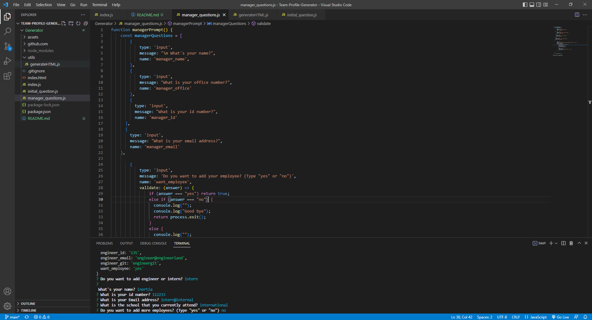

This is a readme for the TEAM PROFILE GENERATOR

THE WAY THIS SHOULD WORK:

this is a generator that produces a team profile based on the command prompt entries.
HOW TO USE: 
1. open index.js in bash
2. npm i
3. node .
4. answer the questions given in the prompt, and the questions will be processed and put into a generator function that produces a profile for you and your entire team.
---------------------------------------------------------------------------------------------------------------------------------------------------------------------------

--------------------------------------------------------------------------------------------------------------------------------
HOW THIS ACTUALLY WORKS:
The prompt works!
the HTML generator pushes out the return but only one of the answers.------  

=[

    https://drive.google.com/file/d/1-AKPhxAd2Td17tB_fQ09P4HzKXHZEcZZ/view -- DEMO OF WHAT I HAVE SO FAR